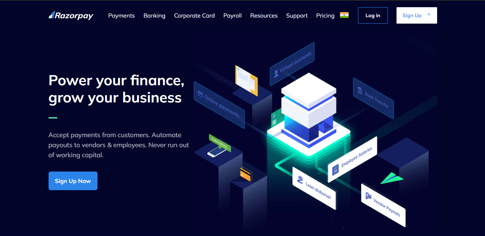

# Razorpay Clone - Front-end



This repository contains a front-end clone of the Razorpay website, created using HTML and Tailwind CSS. The Razorpay clone replicates the user interface and design of the original website, providing a similar look and feel.

## Features

- Responsive layout: The clone is designed to be fully responsive, adapting to different screen sizes and devices.
- Navigation menu: The navigation menu allows users to access different sections of the website easily.
- Payment options: The clone showcases various payment options, including credit cards, net banking, UPI, and more.
- Interactive elements: The clone includes interactive buttons and form fields, providing a seamless user experience.

## Screenshots


## Demo

https://kareen-razorpay-clone.netlify.app/

## Installation and Usage

1. Clone the repository:

```bash
git clone https://github.com/your-username/razorpay-clone.git
```

2. Navigate to the project directory:

```bash
cd razorpay-clone
```

3. Open the `index.html` file in your preferred web browser.

4. Explore the Razorpay clone and interact with the various components and features.

## Technologies Used

- HTML: Used for the markup structure of the web pages.
- Tailwind CSS: Utilized for styling and layout purposes, providing a responsive design.

## Contributing

Contributions to this Razorpay clone repository are welcome! If you have any suggestions, improvements, or bug fixes, please feel free to submit a pull request.

Please ensure that your contributions align with the overall design and style of the clone.

## Acknowledgements

- [Razorpay](https://razorpay.com/) - The original website that inspired this clone.

## Contact

If you have any questions or inquiries regarding this Razorpay clone, please feel free to reach out to me at kareenujjainiya222@gmail.com.

Enjoy exploring the Razorpay clone!

